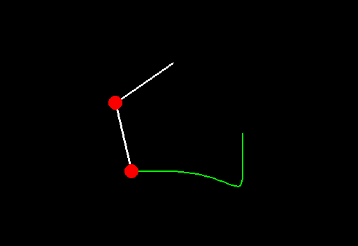

# Multipendulum

The equations of motion of a double pendulum are integrated by Runge Kutta methods
and the solution of the initial value problem is visualized in the phase plane.

Furthermore an animation is created using `pygame`. 
Therefore the program calculates integration steps until you end it by closing the `pygame` window.

## Installation
### Ubuntu/Debian
```
sudo apt install python3-minimal python3-pip 
cd /some/folder/you/like/
# For https:
git clone https://github.com/antonia-kaufmann/multipendulum.git
# For ssh:
git clone git@github.com:antonia-kaufmann/multipendulum.git
cd multipendulum
# if you want to use a virtual environment:
python -m venv venv
. venv/bin/activate
# to install requirements
pip3 install -r requirements.txt 
```

## Usage

```
python double_pendulum.py
```

## Example
### Double Pendulum

